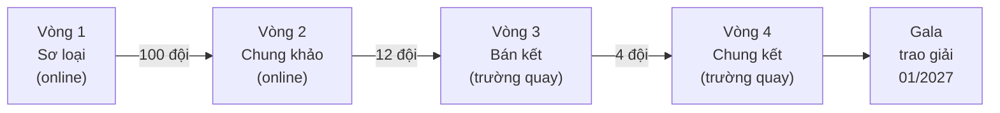

# 🚀 AI THỰC CHIẾN

### Cuộc thi Trí tuệ Nhân tạo ĐẦU TIÊN trên sóng truyền hình Quốc gia

_Tìm kiếm nhân tài AI quốc gia · Xây dựng mô hình Multimodal/LLM/SLM tiếng Việt · Make in Vietnam_

[🌐 Website](https://thucchien.ai) · [📜 Điều lệ](https://thucchien.ai/the-le-cuoc-thi) · [📰 Tin tức](https://thucchien.ai/category/news) · [📘 Fanpage](https://www.facebook.com/people/AI-Th%E1%BB%B1c-chi%E1%BA%BFn/61579169807958/) · [✉️ Liên hệ](mailto:lienhe@thucchien.ai)

---

## ⚡ AI Thực Chiến là gì?

**AI Thực Chiến** là sân chơi công nghệ quy mô quốc gia, nơi các đội thi **thực sự xây dựng sản phẩm AI** và **phát triển, tối ưu các mô hình nền tảng Multimodal/LLM/SLM cho tiếng Việt** ngay tại trường quay VTV, trước Ban Giám khảo gồm chuyên gia, nhà khoa học và nhà đầu tư.

Cuộc thi do **Đài Truyền hình Việt Nam (VTV)**, **Trung tâm Dữ liệu Quốc gia (NDC)**, **Hiệp hội Dữ liệu Quốc gia (NDA)** và **Techcombank** tổ chức, dưới sự bảo trợ của **Bộ Công an**, theo tinh thần **Nghị quyết 57-NQ/TW** về đột phá phát triển khoa học, công nghệ và đổi mới sáng tạo.

> ⏳ **Trạng thái:** Cổng đăng ký mùa mới (19/06 – 30/09/2026) **đã đóng**. Theo dõi [website](https://thucchien.ai) và [fanpage](https://www.facebook.com/people/AI-Th%E1%BB%B1c-chi%E1%BA%BFn/61579169807958/) để nhận thông báo mới nhất từ Ban Tổ chức.

## 🏆 Hệ thống giải thưởng

Tổng giá trị giải thưởng lên đến **hàng tỷ đồng**, vinh danh các đội xuất sắc ở cả truyền hình và nền tảng số.

| Giải | Số lượng | Giá trị |
| :-- | :-: | :-- |
| 💎 **Giải Nhất + Giải thưởng đặc biệt** | 1 | **1 tỷ đồng** tiền mặt **+ 1 triệu USD** "điều kỳ diệu" của Techcombank |
| 🥈 **Giải Nhì** | 1 | **300 triệu đồng** |
| 🥉 **Giải Ba** | 2 | **150 triệu đồng** / giải |
| 🌟 **Giải Triển vọng** | 8 | **50 triệu đồng** / giải |
| 🎖️ **Giải phụ** | 8 hạng mục | **50 triệu đồng** / giải, kèm kỷ niệm chương |

<b>8 hạng mục giải phụ</b>

 

-   Ứng dụng dữ liệu xuất sắc
-   Startup AI toàn năng
-   Ứng dụng AI đẳng cấp quốc tế
-   Sử dụng API hiệu quả
-   Ứng dụng AI sáng tạo
-   Tài năng triển vọng
-   Ý tưởng xuất sắc
-   Khán giả bình chọn

## 🗺️ Lộ trình 4 vòng thi

| Vòng | Thời gian | Nội dung | Kết quả |
| :-- | :-- | :-- | :-- |
| **1. Đăng ký & Sơ loại** _(online)_ | 07 – 09/2026 | Nộp hồ sơ trên [thucchien.ai](https://thucchien.ai): form đăng ký, video 30 giây "Tôi đi thi Thực Chiến AI" và hồ sơ năng lực (nếu có) | BGK chọn **100 đội** xuất sắc nhất |
| **2. Chung khảo** _(online)_ | 09 – 10/2026 | Thử thách tạo sản phẩm AI (video, hình ảnh, văn bản…) bằng API và công cụ AI theo đề của BTC; 100 đội chia **10 bảng** | **10 đội nhất bảng** + **2 đội** do BGK cứu |
| **3. Bán kết** _(trường quay)_ | 10 – 12/2026 | Phát triển và tối ưu mô hình nền tảng **Multimodal/LLM/SLM cho tiếng Việt**: 4 tuần chuẩn bị, thi loại trực tiếp | **3 đội nhất bảng** + **1 đội** được khán giả bình chọn cao nhất |
| **4. Chung kết** _(trường quay)_ | 12/2026 | 4 đội có 4 tuần xây dựng MVP, sau đó pitching và demo trước BGK gồm chuyên gia và nhà đầu tư | Các đội đạt giải chung cuộc |
| **Gala trao giải** | 01/2027 | Công bố và trao giải tại trường quay | 🏆 |

> Lịch trình có thể được điều chỉnh theo tình hình thực tế; mọi thay đổi được công bố trên các kênh chính thức của cuộc thi.

## 🎯 Chúng tôi hướng tới

| | |
| :-- | :-- |
| 🔎 **Tìm kiếm nhân tài AI quốc gia** | Nhân tài phát triển công nghệ nền tảng AI và nhân tài phát triển hệ sinh thái ứng dụng AI |
| 🧠 **Mô hình Multimodal/LLM/SLM tiếng Việt quốc gia** | Khởi động từ AI Thực Chiến, cải tiến theo từng năm; huy động nguồn lực nhà nước, doanh nghiệp, startup, nhà nghiên cứu để làm chủ công nghệ AI theo NQ 57 |
| 🌱 **Hệ sinh thái ứng dụng & startup AI** | Phát triển ứng dụng AI trên cơ sở dữ liệu quốc gia **Make in Vietnam** và vườn ươm startup AI cho Việt Nam |
| 📣 **Lan tỏa tinh thần học và ứng dụng AI** | Nâng cao nhận thức và kỹ năng AI cho thế hệ trẻ, đào tạo nhân lực chất lượng cao, xây dựng văn hóa dùng AI có trách nhiệm |

## 👥 Ai có thể tham gia?

Cuộc thi chào đón mọi cá nhân trẻ muốn khám phá và thực hành AI. Mỗi đội gồm **1 – 3 thành viên**, không phân biệt ngành nghề.

-   🚀 **Startup** — đã có ý tưởng khởi nghiệp, muốn thử nghiệm giải pháp AI thực tế
-   🎓 **Sinh viên** — mọi ngành học, không cần chuyên ngành kỹ thuật, chỉ cần tinh thần học hỏi và sáng tạo
-   🔬 **Nhà nghiên cứu trẻ** — đam mê AI, dữ liệu và các mô hình học máy ứng dụng
-   🧩 **Chuyên gia ứng dụng AI liên ngành**

**Cách tham gia gồm 3 bước:** (1) Thành lập đội và nộp hồ sơ kèm video 30 – 60 giây "Tôi đi thi A.I" → (2) BTC cùng BGK xét duyệt, chọn 100 đội → (3) Bước vào vòng Chung khảo. Chi tiết đầy đủ tại [Điều lệ cuộc thi](https://thucchien.ai/the-le-cuoc-thi).

## 🔓 Cam kết mã nguồn mở

Để tạo di sản công nghệ cho cộng đồng, các đội vào **Vòng 3 và Vòng 4** cam kết **mở mã nguồn** các mô hình ngôn ngữ (Multimodal/LLM/SLM) và thành phần công nghệ lõi phát triển trong cuộc thi, phát hành theo giấy phép mã nguồn mở thông dụng (ví dụ **Apache 2.0** hoặc tương đương), cho phép cộng đồng tự do sử dụng, nghiên cứu và phát triển. Cam kết không áp dụng với các bộ dữ liệu độc quyền do BTC cung cấp.

## ⚖️ Hội đồng Giám khảo & Cố vấn chuyên môn

Quy tụ chuyên gia đầu ngành về trí tuệ nhân tạo, dữ liệu, khởi nghiệp, truyền thông và công nghệ sáng tạo:

| Đơn vị | Góc nhìn đánh giá |
| :-- | :-- |
| **Hiệp hội Dữ liệu Quốc gia (NDA)** | Tính khả thi và giá trị thực tiễn |
| **Trung tâm Dữ liệu Quốc gia (NDC)** | Chất lượng dữ liệu và thuật toán |
| **Đài Truyền hình Việt Nam (VTV)** | Khả năng trình bày, truyền thông và sức lan tỏa |
| **Chuyên gia công nghệ & liên ngành** | Sáng tạo, tiềm năng xã hội và tính truyền cảm hứng |

## 🤝 Đơn vị tổ chức & bảo trợ

-   **Đơn vị bảo trợ:** Bộ Công an
-   **Đơn vị tổ chức:** Đài Truyền hình Việt Nam (VTV) · Trung tâm Dữ liệu Quốc gia (NDC) · Hiệp hội Dữ liệu Quốc gia (NDA) · Ngân hàng TMCP Kỹ Thương Việt Nam (Techcombank)
-   Với sự đồng hành của các trường đại học, viện nghiên cứu, doanh nghiệp công nghiệp, nhà tài trợ trong và ngoài nước

## 📞 Liên hệ & liên kết

| | |
| :-- | :-- |
| 🌐 Website | [thucchien.ai](https://thucchien.ai) |
| 📜 Điều lệ cuộc thi | [thucchien.ai/the-le-cuoc-thi](https://thucchien.ai/the-le-cuoc-thi) |
| 📰 Tin tức | [thucchien.ai/category/news](https://thucchien.ai/category/news) |
| ✉️ Email | [lienhe@thucchien.ai](mailto:lienhe@thucchien.ai) |
| 📘 Fanpage | [AI Thực chiến trên Facebook](https://www.facebook.com/people/AI-Th%E1%BB%B1c-chi%E1%BA%BFn/61579169807958/) |

---

_Thông tin được tổng hợp từ [thucchien.ai](https://thucchien.ai). Lịch trình và cơ cấu giải thưởng có thể điều chỉnh, vui lòng tham khảo thông báo chính thức của Ban Tổ chức._

**© AI Thực Chiến — VTV · NDC · NDA · Techcombank**

_Made with ❤️ for Vietnamese AI Community_

